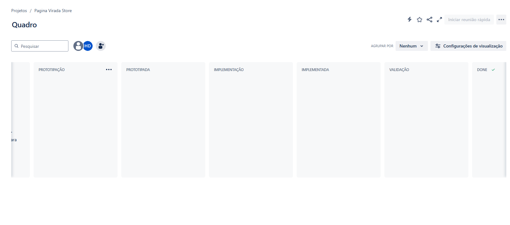
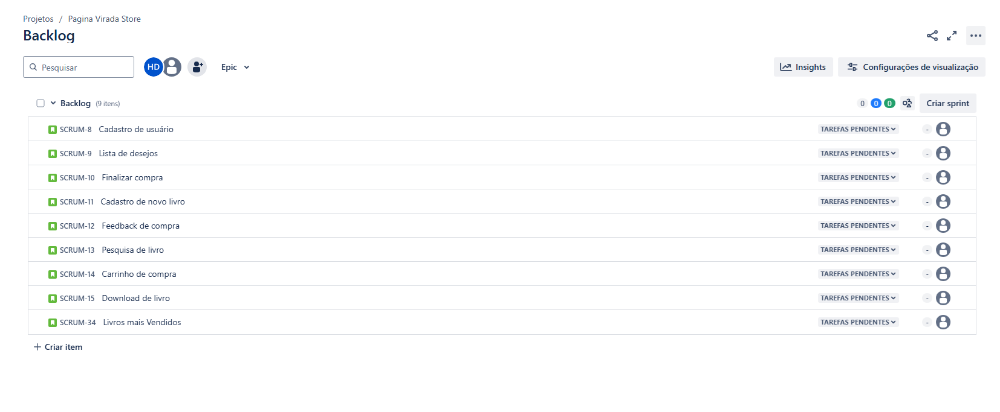

# Página Virada Store.

## Descrição do projeto : 

### O projeto será um e-commerce voltado para venda de livros e e-books.

## Equipe : 

* - Guilherme Rapela Medeiros	- grm2@cesar.school
* - Hugo Diêgo Da Silva Arruda	- hdsa@cesar.school
* - João Guilherme Almeida	- jgbof@cesar.school
* - José Vitor Gomes Veloso	- jvgv@cesar.school
* - Lucas Samuel Pereira Alves	- lspa@cesar.school
* - Rafael Lyra Costa	- rlc3@cesar.school

 ## Links
 * - Figma : https://www.figma.com/design/aDKjwqFzzYOgslpmmFgf3w/Untitled?node-id=0-1&t=petcbihtWxGSNXbQ-1
   - Vídeo : https://youtu.be/muRVmqQawBw
   - Docs com as histórias: https://docs.google.com/document/d/1qxWeY8sgxpPxejGPDY0ZJitrgwIRGgKHSkECFL7OSgg/edit?usp=sharing

 ## Print do Jira

 
 